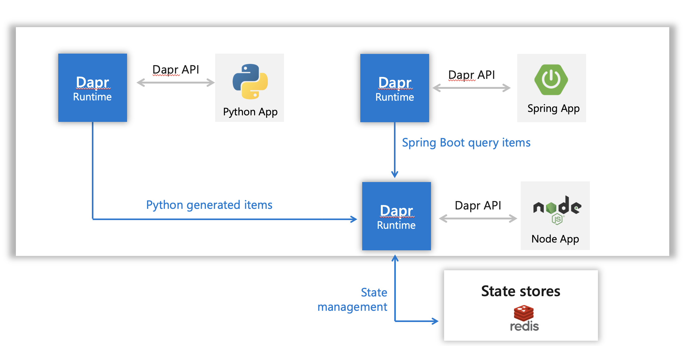
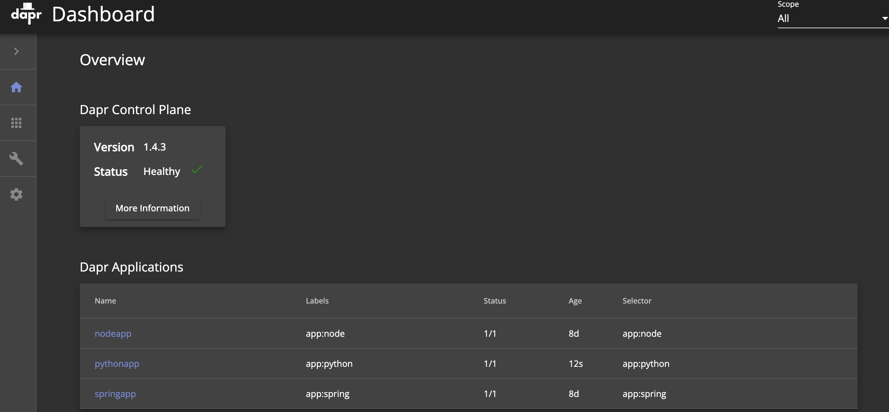

# Service Invocation with Dapr 



## Project information

- The version of programming languages

| Attribute                   | Details |
|-----------------------------|---------|
| Dapr runtime version        | v1.4.0  |
| Dapr CLI version            | v1.4.0  |
| Java version                | Java 11 |
| Python version              | 3.9.7   |
| Node version                | v14.16.0   |

- The API of services

| Service Name                   | Endpoint | Method |
|-----------------------------|---------|---------|
| Nodeapp                     | /order  | GET, POST|
| Springapp            | /customers/orders | GET|

## Run the Dapr sidecar in self-hosted (Docker)
- Run the Node.js app with Dapr
```bash
cd node
npm install
dapr run --app-id nodeapp --app-port 3000 --dapr-http-port 3500 node app.js
```

- Post messages to the node service by Dapr sidecar
```bash
curl -XPOST -d '{"data":{"orderId":"42"}}' -H Content-Type:application/json \
http://localhost:3500/v1.0/invoke/nodeapp/method/neworder
```

- Verify the order was successfully persisted to the state store
```bash
curl http://localhost:3500/v1.0/invoke/nodeapp/method/order
```

- Run the Python app with Dapr
```bash
pip3 install requests
dapr run --app-id pythonapp python3 app.py
```

- Run the Spring Boot app with Dapr
```bash
./mvnw clean package
dapr run --app-id springapp --app-port 8080 -- java -jar target/spring-dapr-0.0.1.jar
```
- Get orders from Spring Boot REST API(/customers/orders)
```bash
curl localhost:8080/customers/orders
```

## Run the Dapr sidecar in K8S
- Check status of Dapr services from Kubernetes
```bash
dapr status -k
```

All services should show True in the HEALTHY column and Running in the STATUS column
```bash
  NAME                   NAMESPACE    HEALTHY  STATUS   REPLICAS  VERSION  AGE  CREATED
  dapr-placement-server  dapr-system  True     Running  1         1.4.3    14d  2021-10-20 10:08.14
  dapr-sidecar-injector  dapr-system  True     Running  1         1.4.3    14d  2021-10-20 10:08.14
  dapr-operator          dapr-system  True     Running  1         1.4.3    14d  2021-10-20 10:08.14
  dapr-dashboard         dapr-system  True     Running  1         0.8.0    14d  2021-10-20 10:08.14
  dapr-sentry            dapr-system  True     Running  1         1.4.3    14d  2021-10-20 10:08.14
 ```
 
- Create and configure a Redis state store, [ref](https://docs.dapr.io/getting-started/configure-state-pubsub/)

- Deploy apps to your Kubernetes cluster
```bash
kubectl apply -f ./k8s-deployment/
```

- Check information and logs of applications running on Dapr with [Dapr Dashboard](https://docs.dapr.io/reference/cli/dapr-dashboard/)
```bash
dapr dashboard -k -p 9999
```

